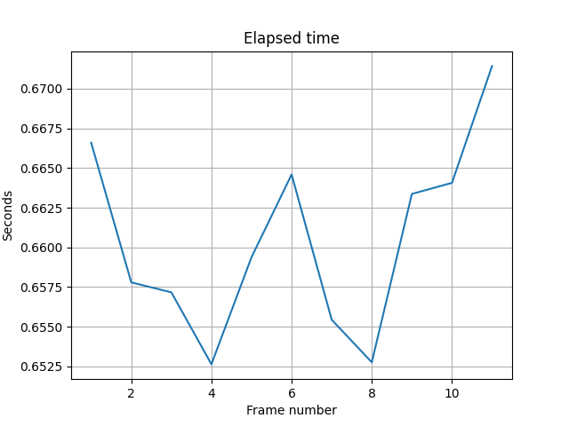

# Task 4: inter-frame shift estimation
Implement inter-frame shift estimation.

## Usage

```
usage: main.py [-h] --frames-dir FRAMES_DIR [--sift-features SIFT_FEATURES] --save-to SAVE_TO

Inter-frame shift estimator.

optional arguments:
  -h, --help            show this help message and exit
  --frames-dir FRAMES_DIR
                        Path to dir with frames for estimation.
  --sift-features SIFT_FEATURES
                        Number of SIFT features to detect (default is 400).
  --save-to SAVE_TO     Path to save file.txt.
```

## Complexity

In view that I fixed the number of keypoints for SIFT detector the complexity 
are based on complexity of SIFT. Particulary - on Space Scale Extrema Detection 
stage. According to [this](https://www.researchgate.net/figure/Comparison-between-SIFT-and-SURF-considering-the-runtime-execution-time_fig4_252048719) 
paper the coomplexity is:

,

where `m` and `n` is a width and height respectively.


## Results

Resulted shifts contains in `results.txt`


