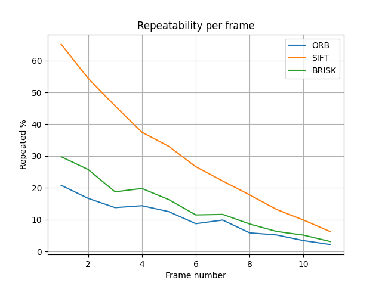

# Task 5: keypoints detectors repeatability estimation
Repeatability estimation for ORB, SIFT and BRISK detectors.

## Usage

```
usage: main.py [-h] --frames-dir FRAMES_DIR [--save-to SAVE_TO]

Inter-frame shift estimator.

optional arguments:
  -h, --help            show this help message and exit
  --frames-dir FRAMES_DIR
                        Path to dir with frames for estimation.
  --save-to SAVE_TO     Path image file for save plot.
```

## Results

,

Detection time per a single keypoint.

| ORB        | SIFT           | BRISK  |
|:-------------:|:-------------:|:-----:|
| 0.020806 ms      | 0.029584 ms | 0.014964 ms |
